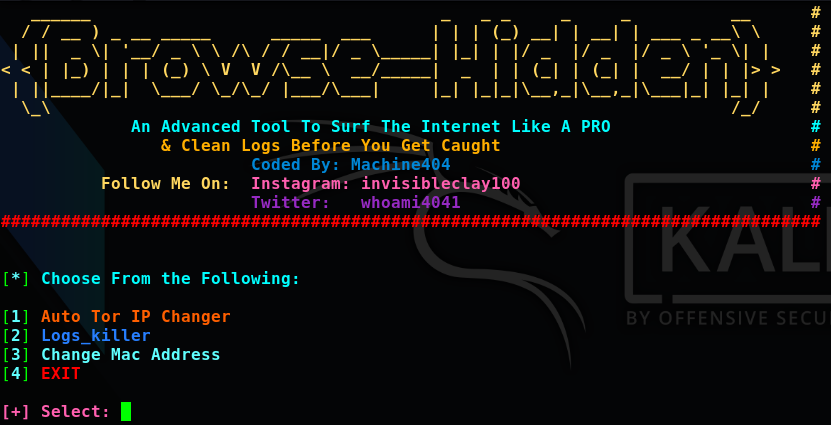
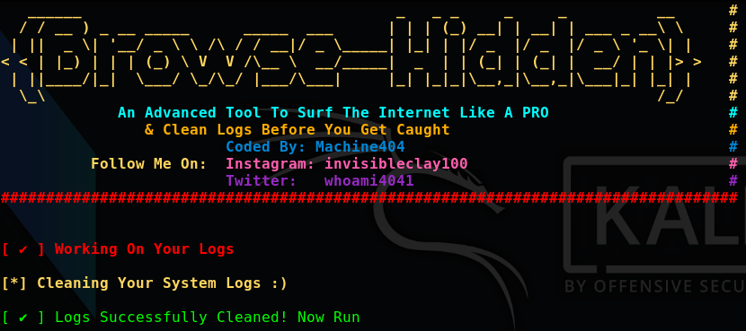
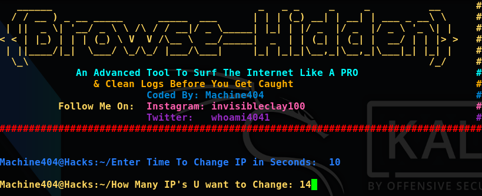
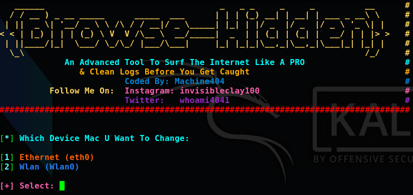

# anonsurf

 
 

# Installation
    1. git clone https://github.com/machine1337/anonsurf
    2. cd anonsurf && chmod +x anon.sh
 
# How To Use:

 https://www.youtube.com/watch?v=Mkka7rOaRhY
 
# Usage

    sudo bash anon.sh
 
    
# Features:
    1. Very Easy Tool To Change IP's In Seconds.
    2. LogsKiller: This will clean all your logs.
    3. Generate Random Strings to assign new MAC Address.
    4. Very Fast And a beginner friendly script 
    5. More Features will be added with time.
    
#  Follow Me On:
    
  1. https://www.facebook.com/pakhack01 
  2. https://instagram.com/invisibleclay100 
  3. https://www.youtube.com/channel/UCC_aPnmV_zGfdwktCFE9cPQ 
